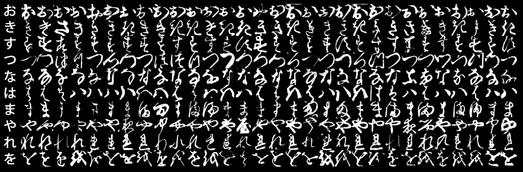

## Projeto

Este projeto de Trabalho de Conclusão de Curso (TCC) tem como objetivo comparar diferentes modelos de aprendizado profundo aplicados a conjuntos de dados de caracteres japoneses cursivos manuscritos, como redes neurais convolucionais (CNNs), redes neurais residuais (RNNs) e *autoencoders*.

## Dataset

**Kuzushiji-MNIST** é um substituto drop-in para o conjunto de dados MNIST (28x28 grayscale, 70000 imagens). Como o MNIST é restrito a 10 classes, 10 caracteres do Hiragana foram escolhido para representar as classes desse conjunto.

**Kuzushiji-49** possui 49 classes (28x28 grayscale, 270912 imagens) e é conjunto de dados desbalanceado com os 49 caracteres do Hiragana.

  
  As 10 classes do Kuzushiji-MNIST, sendo que a primeira coluna mostra a representação moderna do caractere.

## License

"KMNIST Dataset" (created by CODH), adapted from "Kuzushiji Dataset" 
(created by NIJL and others), doi:10.20676/00000341
